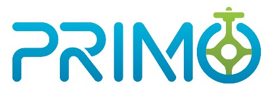

<!--  -->
</img>

# PRIMO - The P&A Project Optimizer Toolkit

PRIMO - The P&A Project Optimizer Toolkit aims to provide multi-scale, simulation-based, open source
computational tools and models to support the Methane Emissions Reduction Program (MERP) and the National
Emissions Reduction Initiative (NEMRI).

## Project Status
[](https://pypi.org/project/primo-optimizer/)
[](https://pypi.org/project/primo-optimizer/)
[](https://github.com/NEMRI-org/primo-optimizer/actions/workflows/checks.yml)
[](https://github.com/NEMRI-org/primo-optimizer/actions/workflows/demo.yml)
[](https://codecov.io/gh/NEMRI-org/primo-optimizer)
[](https://github.com/psf/black)
[](https://primo.readthedocs.io/en/latest/?badge=latest)
[](https://github.com/NEMRI-org/primo-optimizer/contributors)
[](https://github.com/NEMRI-org/primo-optimizer/pulls?q=is:pr+is:merged)
[](https://isitmaintained.com/project/NEMRI-org/primo-optimizer)
[](https://pepy.tech/project/primo-optimizer)

## Getting Started

Our complete documentation is available on [readthedocs](https://primo.readthedocs.io/en/latest/), but here is a summarized set of steps to get started using the framework.

While not required, we encourage the installation of [Anaconda](https://www.anaconda.com/products/individual#Downloads) or [Miniconda](https://docs.conda.io/en/latest/miniconda.html) and using the `conda` command to create a separate python environment in which to install the PRIMO Toolkit.

Use conda to create a new "primo-env" (could be any name you like) environment then activate that environment:
```bash
conda create --name primo-env python
conda activate primo-env
```

Install all dependencies with:
```
pip install -r requirements.txt
```
For developers, install dependencies with:
```
pip install -r requirements-dev.txt
```

For users interested in using the free solver SCIP to solve PRIMO's optimization problems, please run:
```
conda install -c conda-forge -y scip=9.1.0
```

To test the installation of the primo package, execute:
```
pytest primo\utils\tests\test_imports.py
```
The above test, if executed successfully, confirms that primo package is now installed and available in the "primo-env" package that was just created. 

To use the utilities implemented in the PRIMO package that query the U.S. Census API and Bing Maps API, appropriate API keys must be obtained
by signing up with the respective services. These keys must be configured in a .env file in the parent directory. For more details, please see:
[API Keys](https://primo.readthedocs.io/en/latest/method/api_keys.html)

Users can also employ other commercial solvers, for example Gurobi, to solve the optimization problem. 
However, users are responsible for configuring and setting up these solvers themselves

General, background and overview information is available at the [NEMRI website](https://edx.netl.doe.gov/nemri/).

## Funding acknowledgements

This work was conducted as part of the [National Emissions Reduction Initiative](https://edx.netl.doe.gov/nemri/)
with support through the [Environmental Protection Agency - Methane Emissions Reduction Program](https://www.epa.gov/inflation-reduction-act/methane-emissions-reduction-program)
within the U.S. Department of Energy’s [Office of Fossil Energy and Carbon Management (FECM)](https://www.energy.gov/fecm/office-fossil-energy-and-carbon-management).
As of 2023, additional support was provided by FECM’s [Solid Oxide Fuel Cell Program](https://www.energy.gov/fecm/science-innovation/clean-coal-research/solid-oxide-fuel-cells),
and [Transformative Power Generation Program](https://www.energy.gov/fecm/science-innovation/office-clean-coal-and-carbon-management/advanced-energy-systems/transformative).

## Contributing

**By contributing to this repository, you are agreeing to all the terms set out in the LICENSE.md and COPYRIGHT.md files in this directory.**
