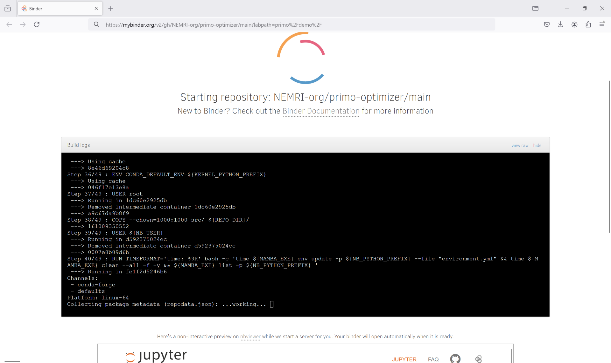
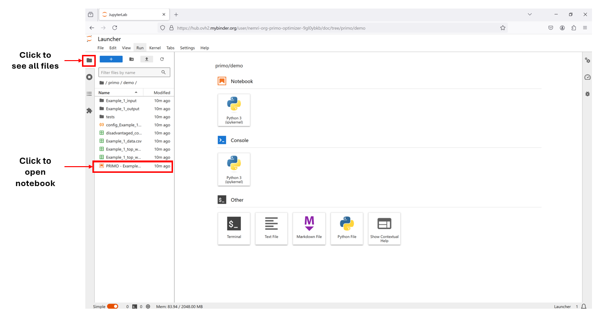
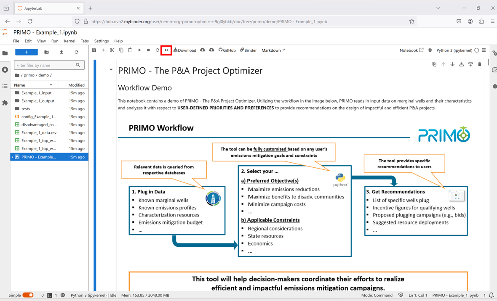
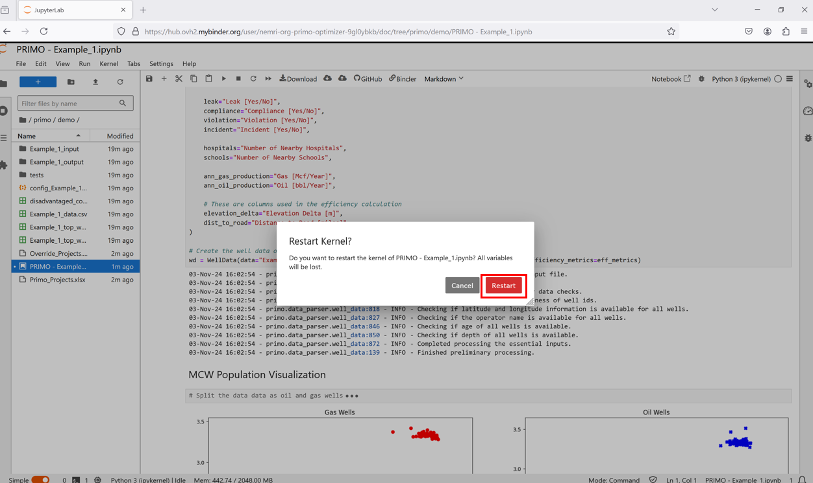

Using PRIMO on Binder
=====================

The :doc:`Quickstart <quickstart>` tutorial walks through the 5 easy steps for installing and running PRIMO on any
machine. However, we recognize that not every user has access to the required IT permissions on their machines to
carry out the installation. For such users, we have made PRIMO available via a free and public service through Binder.
This allows anyone to access, experiment with and run PRIMO from a web browser with **no installation** needed.
The steps to access PRIMO via Binder follow. Please note that:

* The Binder environment is **public and therefore insecure**. Sensitive data should NOT be uploaded/used on this environment. This environment should be used only for **testing, exploration and experimentation** purposes.
* The Binder environment is automatically deleted after 10 minutes of inactivity. To avoid lost work, please download your work locally on a periodic basis. 
  
Please reach out to the NETL team (primo@netl.doe.gov) for any questions or concerns. 
We remain committed to helping states implement the MERP in any way we can.

Steps to use PRIMO on Binder
----------------------------

Step 1: Trigger Binder environment
----------------------------------

Navigate to this `link <https://mybinder.org/v2/gh/NEMRI-org/primo-optimizer/main?labpath=primo%2Fdemo%2F>`_. 
Please wait for a temporary environment to be constructed on mybinder.org for you. This process can take up to 
**a few minutes**. 

    The Binder environment for PRIMO being built

Step 2: Open PRIMO Example Notebook
-----------------------------------
In the JupyterLab Server that is launched, select the PRIMO - Example_1.ipynb notebook and open it.

    Open the PRIMO Example Notebook

Step 3: Run the notebook
------------------------

Click the 'forward' button to restart kernel and run all cells in the notebook and peruse the results. Please 
select "Restart" if a warning pops up. 

    Run the PRIMO Example Notebook

    Select Restart when the warning pops up

You are all set! You can now experiment with PRIMO in a browser environment by updating this Jupyter notebook 
with no installation necessary!