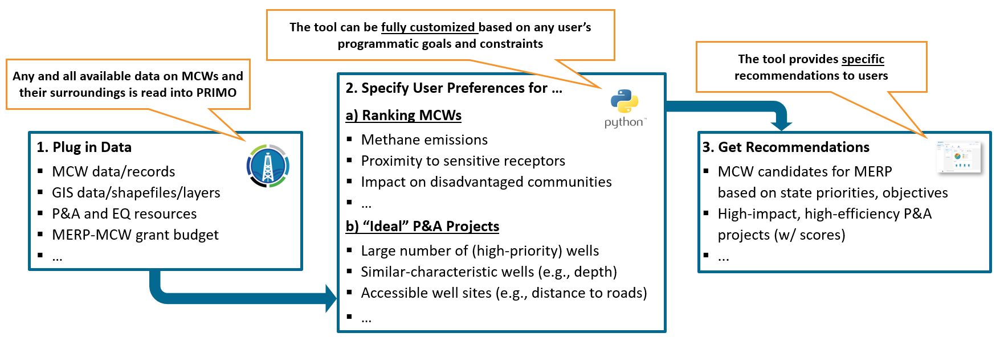

.. index::
    pair: primo;Home

PRIMO - The P&A Project Optimizer
==============================================================

PRIMO Description
-----------------
In support of the Methane Emissions Reduction Program (MERP) and under the National Methane Emissions Reduction Initiative (NEMRI), 
the National Energy Technology Laboratory (NETL) and NETL site support contractors are developing and releasing an open-source
decision-support tool (“PRIMO”) to help organizations determine which marginal conventional wells (MCWs) or other low-producing wells
make the best candidates for plugging utilizing MERP funds,
while also optimizing subsequent plugging and abandonment (P&A) campaigns for both program impact and efficiency. 
The framework---which is fully customizable---provides three main capabilities:

1. Ranking candidate wells (based on user preferences)
2. Identifying high-impact, high-efficiency P&A project candidates (with transparently computed scores for relevant metrics)
3. Comparing competing P&A projects quantitatively (through transparently computed project impact and efficiency scores)

As such, PRIMO is a versatile, fully customizable tool that is meant to support organizations in making data-based, transparent, and defensible well selection and
P&A project design decisions. 

Please note that PRIMO is in early stages of development with ongoing efforts to add functionality and make the tool more robust. For questions, comments or feedback, please 
contact primo@netl.doe.gov.

PRIMO Workflow
-----------------

.. _workflow:

    The PRIMO workflow

The targeted workflow is shown in :numref:`workflow`.

#. Relevant data are read into the tool (e.g., MCW records, Economic Justice (EJ)/ Disadvantaged Communities (DAC) layers, population data, MERP budget, P&A cost assumptions). 

#. Users specify their preferences for:

    a) Ranking wells (e.g., methane emissions, impact on disadvantaged communities, proximity to sensitive receptors)
    b) Optimal P&A projects (e.g., number of wells, proximity of wells to each other, record completeness)
  
#. Users are provided recommendations given their data, preferences, and program constraints, including: 

	a) Ranked list of high-priority wells
	b) Pool of high-impact, high-efficiency P&A projects

Given the open-source nature of the underlying code architecture, PRIMO enables fully transparent and defensible decision-making. 
External stakeholders can easily retrace why specific wells were selected for plugging utilizing MERP funds given the available data and 
the user-specified filters, priorities, objectives, and constraints. 

PRIMO Premises
-----------------
PRIMO is being released as free and open-source software, with increasing capabilities and functionality becoming available 
over time. An appealing graphical user interface is actively being developed which will make the tool more accessible to users with no 
coding/optimization expertise. 
The project team is also committed to conducting case studies involving financial assistance recipients. 

Contact Us
----------

.. _contact_us:

For any inquiries, questions or comments, please contact primo@netl.doe.gov.

Contents
--------

.. toctree::
    :maxdepth: 1

    documentation
    install
    quickstart
    workflow
    method/index
    model_library/index
    example
    Utilities/modules
    faq
    license
    copyright
