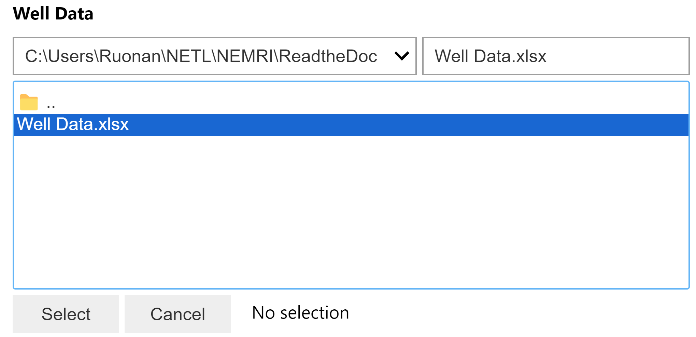
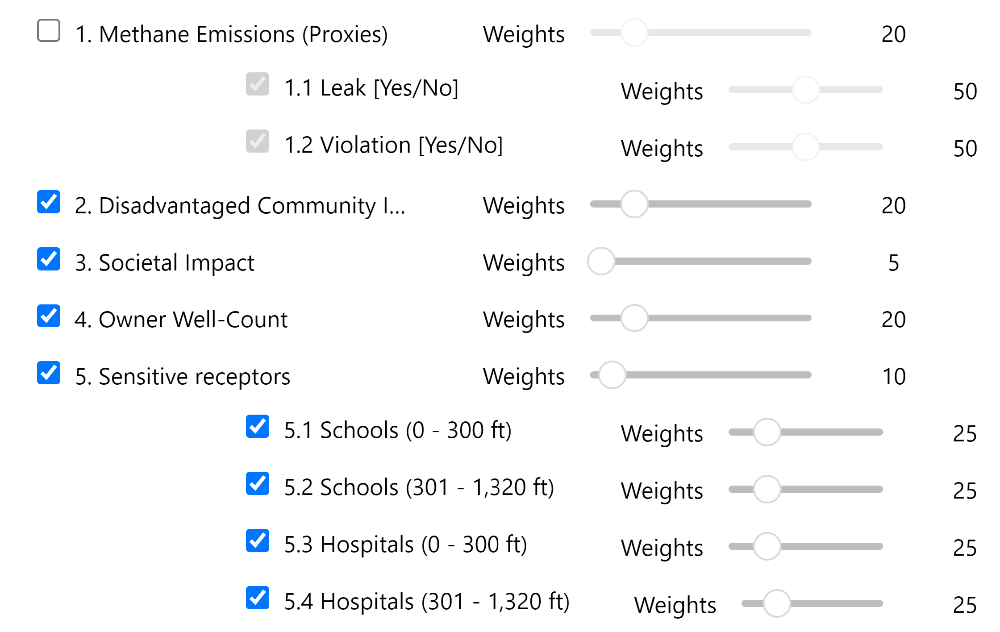

How to Provide Inputs to PRIMO
==============================

Input Types
-----------
Inputs for PRIMO can be of one of the following three types:

- :ref:`Data Files <data_files>`
- :ref:`Metrics <metric>`
- :ref:`Constraints <constraints>`

.. _data_files:

Data Files
^^^^^^^^^^
Data files for PRIMO can include information on candidate wells or necessary data for calculating efficiency and priority scores. 
Common file formats include .csv and .xlsx. Users can specify the input file using a file path widget. 
An example for the file path widget is shown in :numref:`file-widget`.

.. _file-widget:

    File upload widget

Users are required to consistently provide well information, so the corresponding file path widget remains essential. 
Meanwhile, widgets for files associated with priority and efficiency score calculations only appear when relevant factors are 
selected and weights are designated as greater than zero.

.. _metric:

Metrics
^^^^^^^
When implementing the priority and efficiency metrics in PRIMO, users must provide both the factor and its 
corresponding weight. Users can select factors for well-ranking by checking the checkbox and can exclude factors by 
unchecking the corresponding box. Each selected factor requires a weight assignment using a slider.

If a factor has associated sub-factors, as illustrated in :numref:`metric-figure`, users must specify weights for both 
the parent factor and each selected sub-factor. Sub-factors are automatically deselected when the parent factor 
is not selected.

.. _metric-figure:

    Priority metric selection.

.. note::
    The sum of weights for all parent factors should be 100. Likewise, for any selected parent factor, 
    the total weights of all corresponding sub-factors should also sum to 100.

.. _constraints:

Constraints
^^^^^^^^^^^
PRIMO allows users to implement constraints that should be applied to the P&A projects; for example:

- Total available budget for plugging marginal wells
- Budget available for each P&A project
- Percentage of wells located in disadvantaged communities
- Number of plugged wells belonging to the same owner

To implement a constraint, users should check or uncheck the corresponding checkbox and specify the corresponding value 
in the State-wide Program Constraints section, as illustrated in :numref:`constraint-figure`.

.. _constraint-figure:

    State-wide program constraint selection

Provide Inputs Using Config File
-----------------------------------
Currently, PRIMO includes typical priority metrics, efficiency metrics, and constraints by default. If more metrics or constraints are
needed, users will have to modify the :doc:`config file <config_file>`.

