Quickstart 
==========

This tutorial provides a brief step-by-step tutorial on how to download, set up PRIMO on your machine 
and run the examples provided. For a more detailed overview or for developers wishing to contribute to the 
PRIMO source code, please refer to sections :doc:`Getting Started <install>`, :doc:`Workflow <workflow>` and 
:doc:`Examples <example>`.  

Step 1: Download the source code from GitHub 
--------------------------------------------

.. _download:

* Navigate to the `GitHub Repository <https://github.com/NEMRI-org/primo-optimizer>`_. 
* Click on the Green Code button and select Download Zip as shown `here <https://docs.github.com/en/repositories/working-with-files/using-files/downloading-source-code-archives#downloading-source-code-archives-from-the-repository-view>`_.
   
.. figure:: _static/download_zip.png
    :width: 800
    :align: center

    `Downloading code from GitHub <https://docs.github.com/en/repositories/working-with-files/using-files/downloading-source-code-archives#downloading-source-code-archives-from-the-repository-view>`_

* Save the zip in a preferred location and extract the contents. In example below, the code is stored at "C:\\codes\\primo-optimizer"

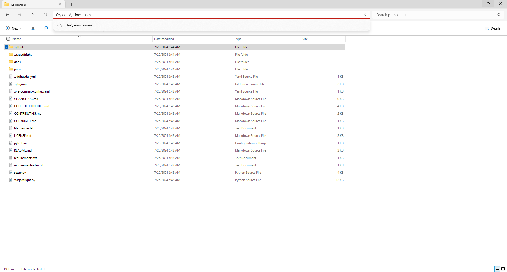

    Extracted source code on Windows 

Step 2: Install Python
----------------------

* Download installer from `Anaconda <https://www.anaconda.com/products/individual#Downloads>`_ .
* Install Anaconda using the downloaded installer.

Step 3: Install PRIMO and required dependencies
-----------------------------------------------
* Open the Anaconda prompt. 

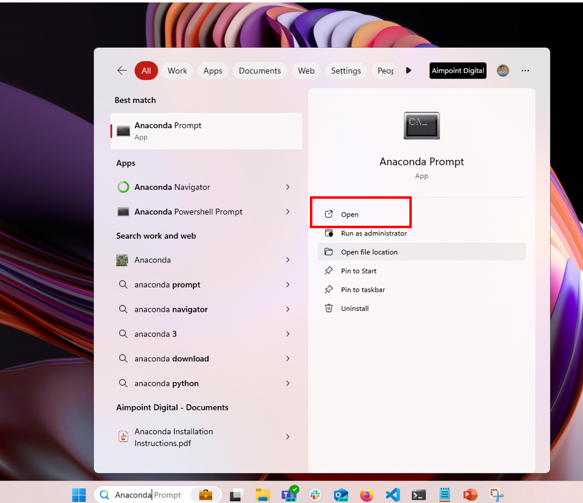

    Opening Anaconda prompt from Start Menu on Windows

* Navigate to the directory where PRIMO source code is extracted. The path to this directory can be copy-pasted from Windows Explorer.

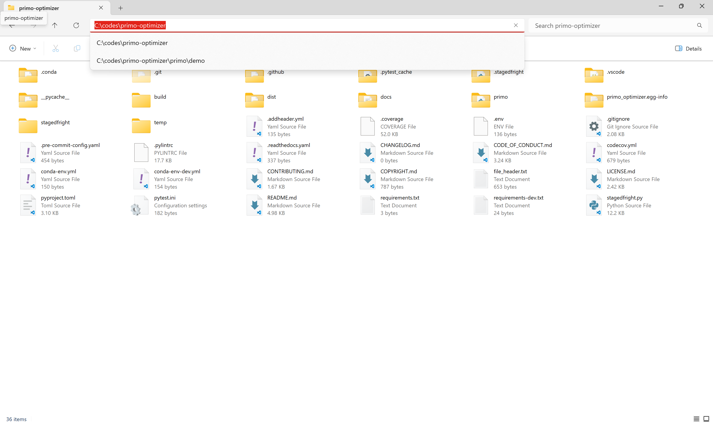

    Obtaining the path where PRIMO source code is downloaded from Windows Explorer

* Change active directory in Anaconda prompt with the following command. Please replace the <path> below with the location of the directory copied in the previous step. ::

    cd "<path>"

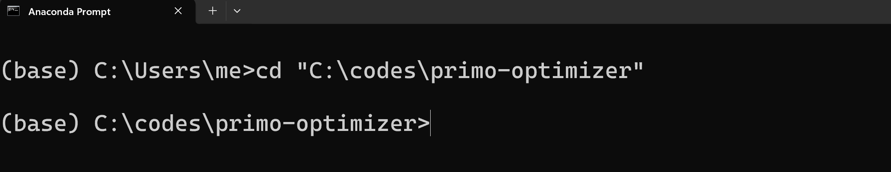

    Changing active directory

* Create a new "primo" environment with all dependencies installed as follows::

    conda env create -f conda-env.yml

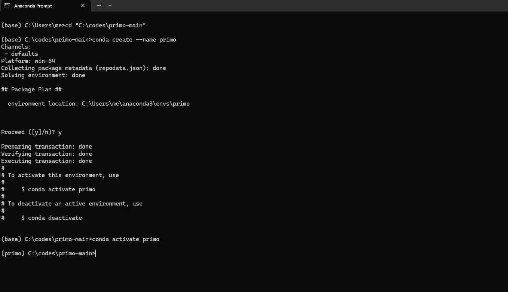

    Creating a new 'primo' environment

* Activate the newly created "primo" environment as follows. Note that the command prompt says `(primo)` on the left instead of `(base)` once the environment is successfully activated::

    conda activate primo

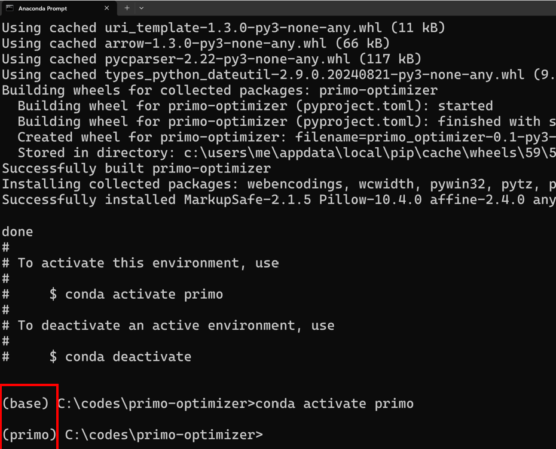

    Activating the new 'primo' environment

* Note that the the free and open-source solver `SCIP <https://scipopt.org/>`_ will also get installed with the above step. PRIMO can also utilize other free or commercial optimization solvers if you have access to other solvers already.

Step 4: Run Examples in Jupyter Notebook 
----------------------------------------

* Launch Jupyter Notebook using the command below. A new window in your favorite internet browser should automatically open. You can also navigate to the 
  notebook by going to one of the links that are displayed after running the command. ::
  
    jupyter notebook

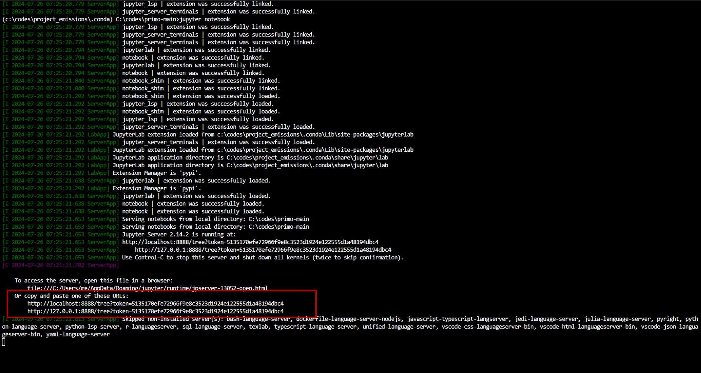

    Launching Jupyter Notebook

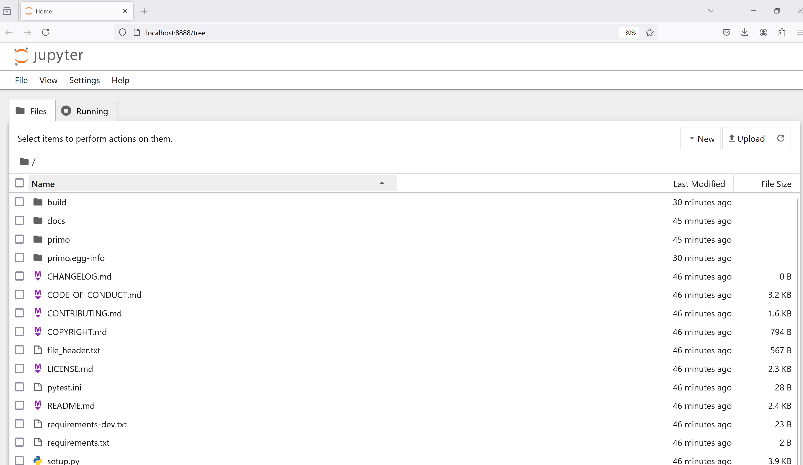

    Jupyter Notebook Window in Browser

* Navigate to "primo/demo" folder and open "PRIMO - Example_1.ipynb" by clicking on it.

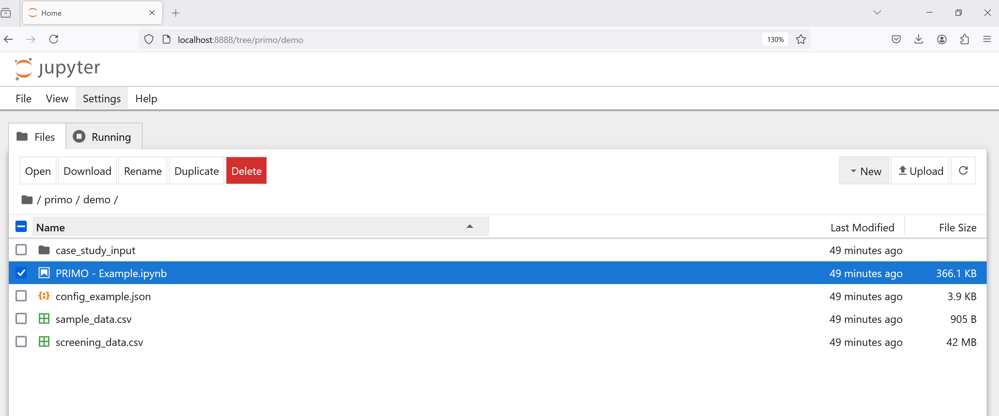

    Launching the example Notebook

* Run all cells in the Jupyter Notebook.

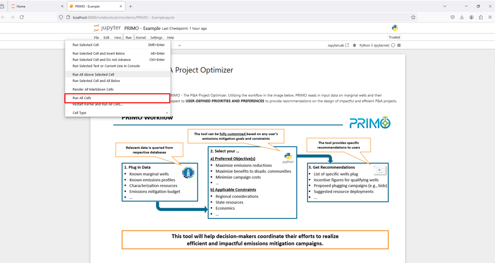

    Run all cells in the Jupyter Notebook

* The Notebook takes a few minutes to execute. On successful execution, a new file "PRIMO_Example_1_projects_results.xlsx" will be generated in the "primo\\demo\\PRIMO_Example_1_output" folder. PRIMO is now successfully installed and configured on your machine.

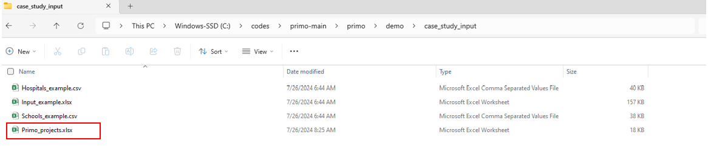

    Output file generated on successful execution of the Notebook

  
Step 5: (Optional) Configure .env file with credentials
-------------------------------------------------------
The Notebook "PRIMO - Example.ipynb" relies on randomized data for illustrative purposes. When working with real data sets and if desired, PRIMO can utilize external APIs such as 
the `Bing Maps API <https://www.bingmapsportal.com/>`_  and the `US Census API <https://api.census.gov/data/key_signup.html>`_ . 
Please sign up for API keys by visiting the respective websites. 

These API Keys can be utilized by providing them in a .env file. A .env file is a text file at the root folder of the project formatted as follows::

    BING_API_KEY="My Bing maps key"
    CENSUS_KEY="My census key"

For more details, please see `API Keys <https://primo.readthedocs.io/en/latest/method/api_keys.html>`_.

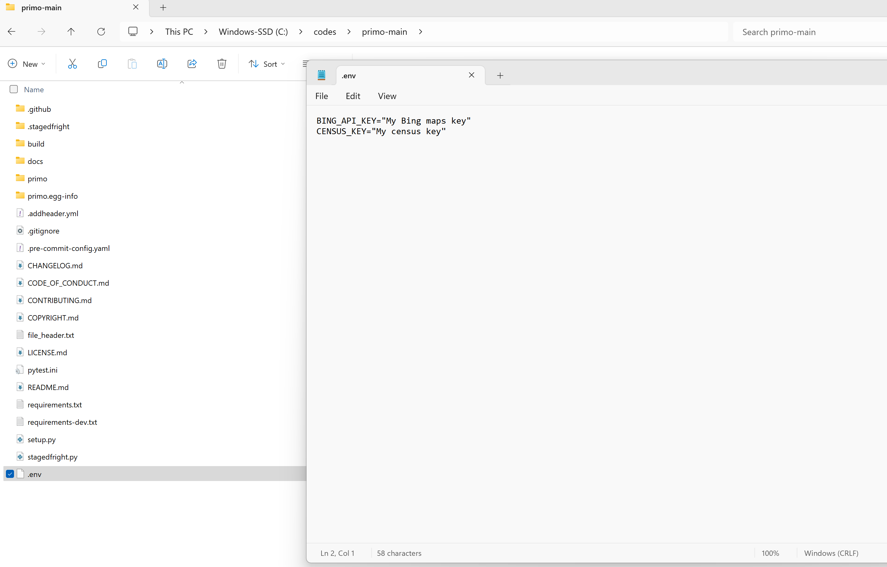

    .env file to provide API credentials

.. note::
    The .env file has extension .env and no name. If you run into errors, please confirm the file is not accidentally named .env.txt.